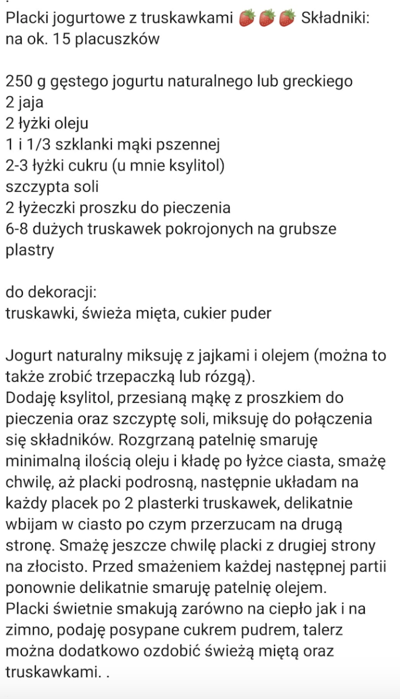

# Sniadania

## Racuszki z owocami

## Tosty z awokado i jajkiem sadzonym
https://www.kwestiasmaku.com/przepis/tosty-francuskie-z-awokado-i-jajkiem-sadzonym

Składniki:
* 1 awokado
* 1/2 ząbka czosnku
* 4 tosty
* 3 jajka
* 5 łyżek mleka
* klarowane masło do smażenia
* dowolne dodatki np. płatki chili, listki kolendry lub bazylii, pokrojone pomidorki koktajlowe

Przygotowanie:

* Awokado obrać, przekroić na pół, usunąć pestkę. Miąższ pokroić na kawałki a następnie rozgnieść widelcem. Dodać przeciśnięty przez praskę czosnek oraz sól i pieprz, wymieszać.
* W głębokim talerzu roztrzepać widelcem 1 jajko z dodatkiem mleka oraz szczypty soli. Na 2 kromkach tosta położyć pastę z awokado, przykryć drugą kromką tosta, lekko docisnąć. Wymaczać z dwóch stron i z boków w roztrzepanym jajku i położyć na patelnię z podgrzanym masłem klarowanym.
* Smażyć na umiarkowanym ogniu z dwóch stron na złoty kolor, po ok. 2 minuty z każdej strony. Oddzielnie usmażyć 2 jajka sadzone.
* Tosty przełożyć na talerze, przykryć jajkiem sadzonym i posypać dowolnymi dodatkami.

## [SPA] Jajka z chorizo
https://www.kwestiasmaku.com/przepis/jajka-z-chorizo-w-sosie-pomidorowym

Składniki:
* 75 g kiełbaski chorizo
* 200 ml przecieru pomidorowego lub krojonych pomidorów
* 4 jajka
* opcjonalnie: płatki chili i rukola

Przygotowanie:
* Na patelni na małym ogniu podsmażyć pokrojone w plasterki chorizo (przez kilka minut aż wytopi się tłuszcz). Ostrożnie wlać sos pomidorowy (może pryskać) i zagotować.
* Wbić jajka i na małym ogniu gotować ok. 10 minut bez mieszania (na ostatnie 3 minuty ewentualnie przykryć pokrywką aby białka się ścięły).
* Opcjonalnie posypać płatkami chili i świeżą rukolą.

## Puszysty omlet na słodko
https://www.ofeminin.pl/kuchnia/przepisy/omlet-puszysty-w-dwoch-wersjach-slodkiej-i-wytrawnej/r61hgex

Składniki:
* 2 łyżki mleka,
* pół łyżeczki proszku do pieczenia,
* 2 jajka,
* 2 łyżki mąki,
* odrobina cukru,
* szczypta soli,
* dowolny tłuszcz do smażenia
* mascarpone
* owoce np. maliny i borówki

Przygotowanie:

Omlet:
* Białka oddzielamy od żółtek i ubijamy na sztywną pianę. 
* Żółtka mieszamy z mąką, proszkiem do pieczenia i mlekiem. 
* Dodajemy szczyptę soli i cukru. 
* Do tak przygotowanej masy ostrożnie dodajemy ubitą pianę. 
* Całość delikatnie mieszamy. 
* Omlet smażymy na rozgrzanej patelni z dodatkiem oliwy lub oleju – powinien być rumiany z obu stron.
* W połowie smażenia przewracamy omlet na drugą stronę przy pomocy talerza (samą łopatką jest ciężko bo się rozwala).

Dodatki:
* Roztapiamy mascarpone z cukrem na patelni.
* Polewamy omlet.
* Dodajemy owoce.

## Szakszuka z Dinette
Składniki:
* 2 jajka z wolnego wybiegu
* pomidory pelati
* cebula
* czosnek
* imbir 
* chili 
* kmin rzymski 
* sól pieprz
* cukier
* kolendra

Przygotowanie:
* zagrzej średnią patelnię z łyżką oleju lub masła klarowanego na średnim ogniu (patelnia nie może być zbyt gorąca)
* wlej na patelnię zawartość szakszuki
* podgrzewaj na średnim ogniu około 2 min bez mieszania
* weź łyżkę i wciśnij ją w miejsce, gdzie chcesz wbić jajka (zrób dołeczek dla każdego jajka, ale nie zbyt głęboki - na spodzie wciąż musi być szakszuka)
* wbij tyle jajek ile masz dołeczków, przykryj patelnię pokrywką i poczekaj aż jajko się zetnie tak jak lubisz. 
* Gdy jajka są ścięte, możesz jeść szakszukę prosto z patelni, lub delikatnie przełożyć ja na talerz. 

## [MEX] Jajka po ranczersku
https://www.kwestiasmaku.com/przepis/jajka-po-ranczersku

To jest dlugie śniadanie!

Składniki:
* 80 g boczku parzonego / wędzonego
* 1/2 małej cebuli
* 150 g czerwonej fasoli z zalewą
* przyprawy: sól i pieprz oraz (opcjonalnie) szczypta kminu rzymskiego i wędzonej papryki
* tortilla (1 duża lub 2 małe)
* 2 łyżeczki masła
* 2 jajka
* 1 pomidor lub 10 pomidorków koktajlowych
* 1/4 czerwonej cebuli
* 1/2 awokado
* do podania: świeża kolendra i limonka oraz (opcjonalnie) plasterki chili lub jalapeno

Przygotowanie:
* Boczek pokroić w kostkę, włożyć na patelnię i na małym ogniu wytopić z tłuszczu. Przełożyć na talerz zostawiając tłuszcz na patelni.
* Na pozostałym tłuszczu zeszklić drobno posiekaną cebulę. Dodać fasolę z kilkoma łyżkami zalewy oraz przyprawy. Chwilę podgrzać po czym rozgnieść wszystko praską do ziemniaków na w miarę jednorodną pastę.
* Na dużej patelni rozgrzać łyżeczkę masła i podsmażyć placek tortilli. Tortillę przełożyć na talerz, następnie na patelnię dodać drugą łyżeczkę masła i usmażyć sadzone jajka.
* W międzyczasie przygotować salsę pomidorową: pomidora pokroić w kostkę, czerwoną cebulę drobno posiekać.
* Tortillę posmarować pastą z fasoli, ułożyć sadzone jajka, podsmażony boczek i salsę pomidorową. Dodać pokrojone plasterki awokado, posypać kolendrą, doprawić solą i pieprzem. Awokado i salsę skropić sokiem z limonki, opcjonalnie dodać plasterki chili lub jalapeno.

## Croque madame
https://www.kwestiasmaku.com/przepis/croque-madame

Składniki:
* 4 tosty
* 60 g tartego sera żółtego
* 2 plasterki szynki
* 3 jajka
* 5 łyżek mleka
* (klarowane) masło do smażenia

Przygotowanie:
* Rozłożyć tosty na desce, na każdym ułożyć tarty ser. Na dwóch tostach położyć plasterek szynki. Podtrzymując szynkę palcami odwrócić tosty z szynką i ułożyć na tostach z samym serem. Lekko docisnąć.
* W głębokim talerzu roztrzepać widelcem 1 jajko z dodatkiem mleka oraz szczypty soli. Maczać w tym tosty i kłaść na patelnię z podgrzanym masłem (najlepiej klarowanym).
* Smażyć na umiarkowanym ogniu z dwóch stron na złoty kolor, po ok. 1,5 minuty z każdej strony. Oddzielnie usmażyć 2 jajka sadzone. Tosty przełożyć na talerze i przykryć jajkiem sadzonym.
